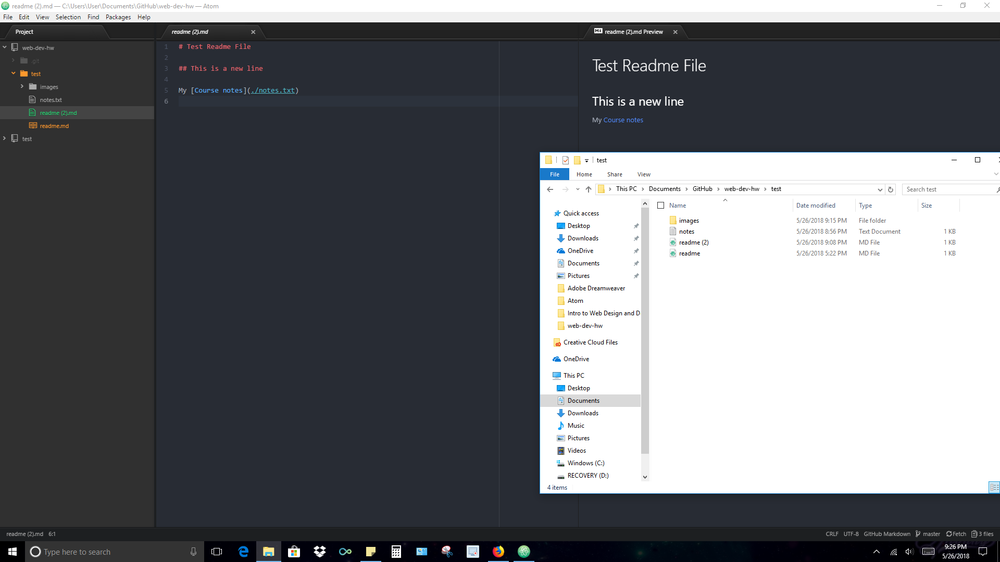

## Assignment 2
A version control system is like a working website timeline for developers. 
It helps developers keep track of there changes in there design. 
I believe we are using one in this class because we will consistently 
be making changes in this class and if we make a mistake we can always 
go back to an earlier version.

This assignment was different but exciting to do because I have never worked 
with these programs before and to see them work together is a nice reward.

