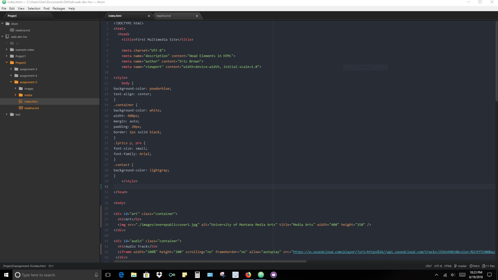
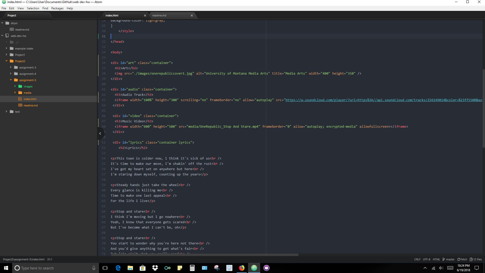

<h2>Eric Brown</h2>

You can only have one pair of the head and body tags because it is what the browser see's. 
The head element is a container for processing information and document metadata. 
The body element is a container for all of the content and data that is intended to be displayed on a browser’s page.

Structural markup embeds information about the structure of a document. Structure includes elements such as:
    Headings
    Paragraphs
    Breaks
    Lists

Semantic markup is used to place emphasis on words or phrases in a document.

This assignment was challanging and rewarding at the same time. Using the different elements and see
how the web page starts to form.

