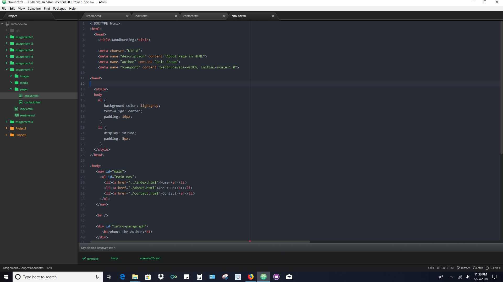
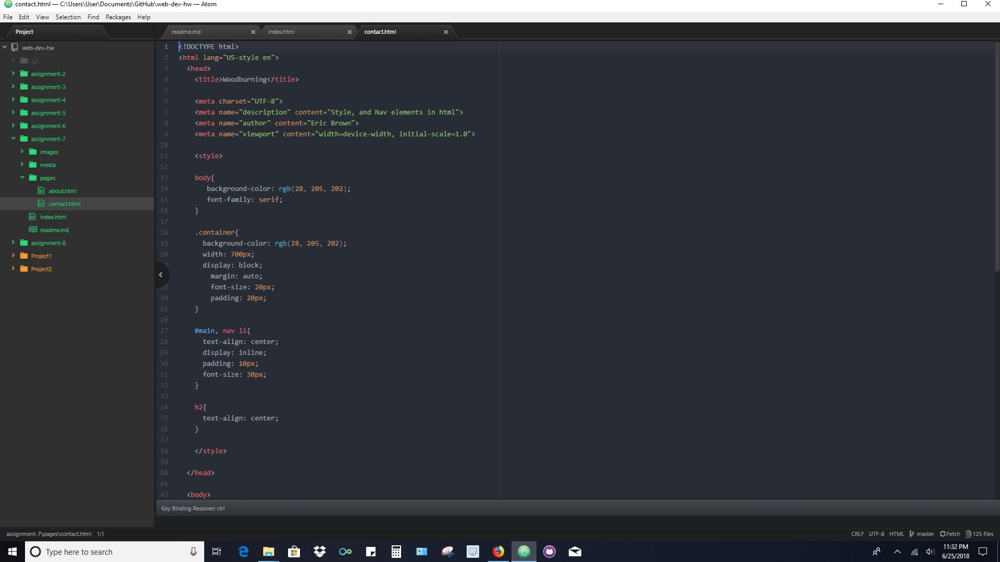
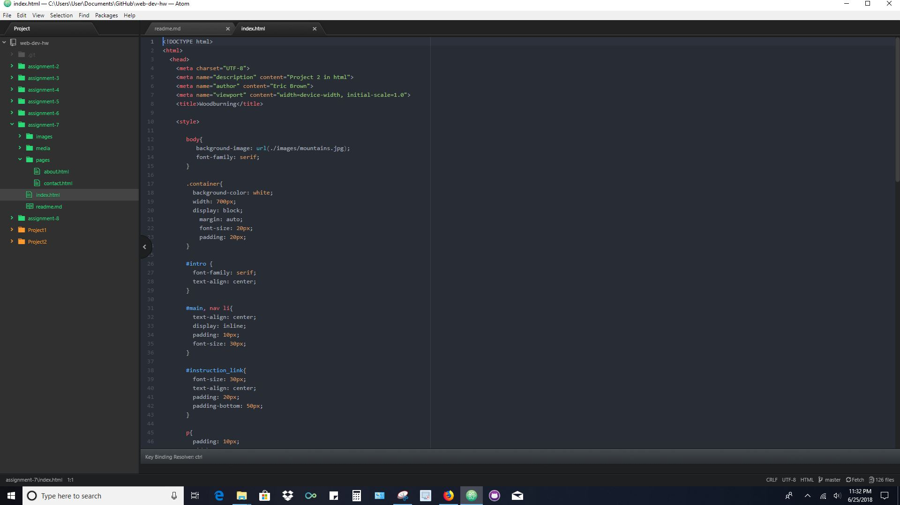

<h2>Eric Brown</h2>

b.) I guess the same was the basic set-up of the page the basic html tags. I found alot of things new and interesting.
like stylesheets intenal and external and linking them but having them in there own folder.

The different website
layout designs.

c.) Styling html and using stylesheets for different effects I think will be fantastic.

d.) This assignment was fun but next time I think I will write down everything I want to say and design it first on paper then design it. For me I think that would be best.

e.) 
f.)
g.)
