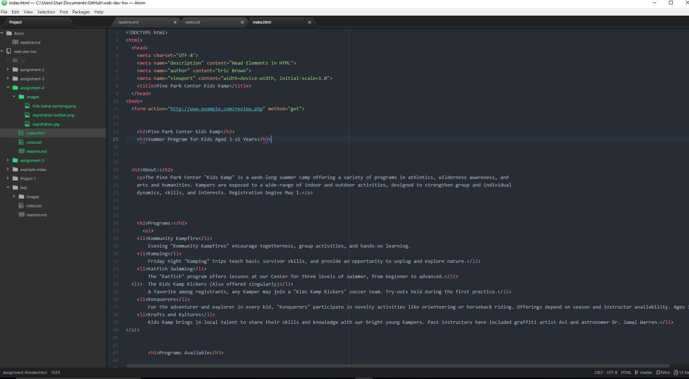

<h2>Eric Brown</h2>

The alt text is used by screen readers for those who are visually impaired.

When I apply for certain lines of credit, job applications are just some of the forms I have come accross.

This assignment was challanging for me because I see how they are built and the code to make them work its just formatting them to make them look more professional. But at least know I have the basic knowledge of how to make them look professional looking I just need more practice, but loved the challange for sure.

