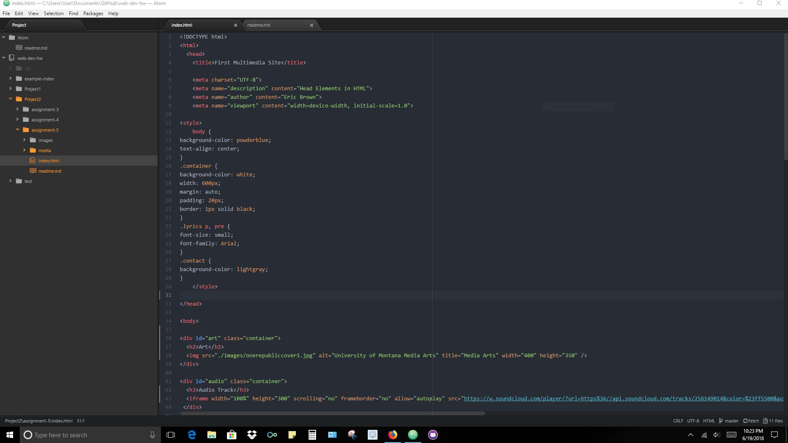
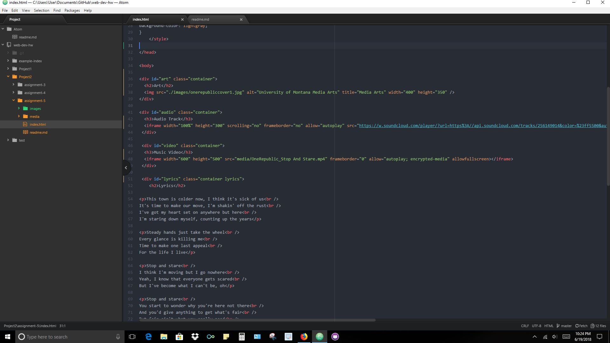
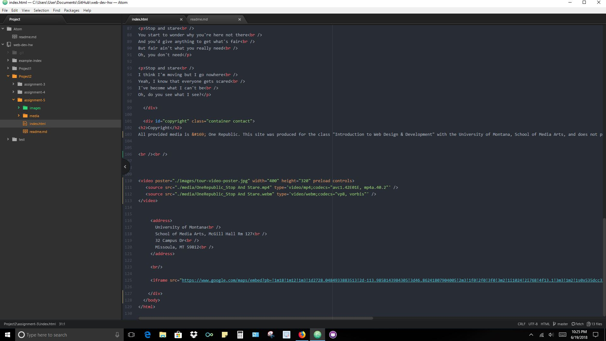

<h2>Eric Brown</h2>
The Div element divides code in blocks. 
The id element identifies is a unique identifier to a certain element. 
The class attribute is a identifier and selector for HTML elements. 
The span element applies a certain style to a specific text.

Third party hosting seems more financially sound compared to web hosting companies because of the bandwidth of videos.

Overall this assignment was a little hard with the audio and video code, but when I got it. It was rewarding to see it work. I'm still a little foggy on the using a second class but I will look into it further.

