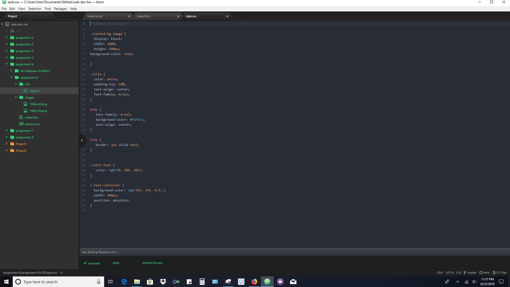
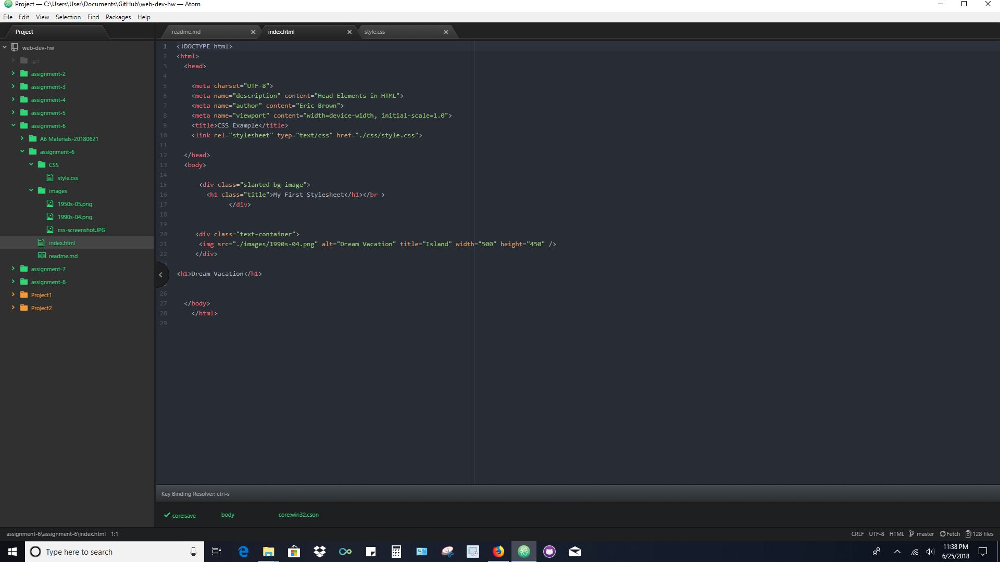

<h2>Eric Brown</h2>

b.) I did a very basic layout and design page for the 1990s, but what I seen and if I had more time I would design something cool and a lot more fun,
but what I learned will take me towards reaching that goal in the future after I have more practice.

c.) I chose teal for the top half of my webpage and for the bottom half I chose F1F1F1 (grey), and 255,255,0.5 for my text container very light shade of grey.

d.) This assignment was fun but I definitely need a lot more practice doing styles but at least now I have a basic Idea of how they are done.

e.) 
f.) 
